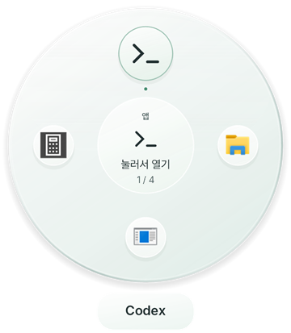
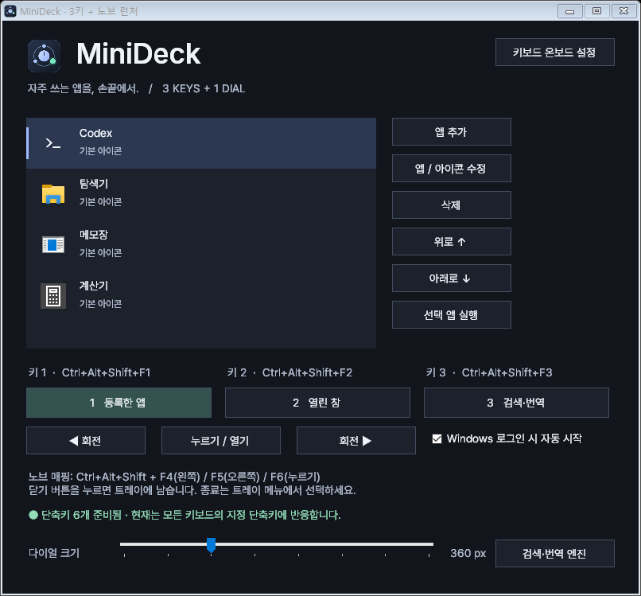
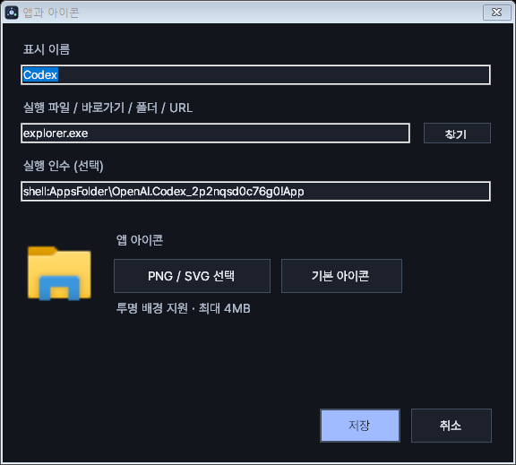
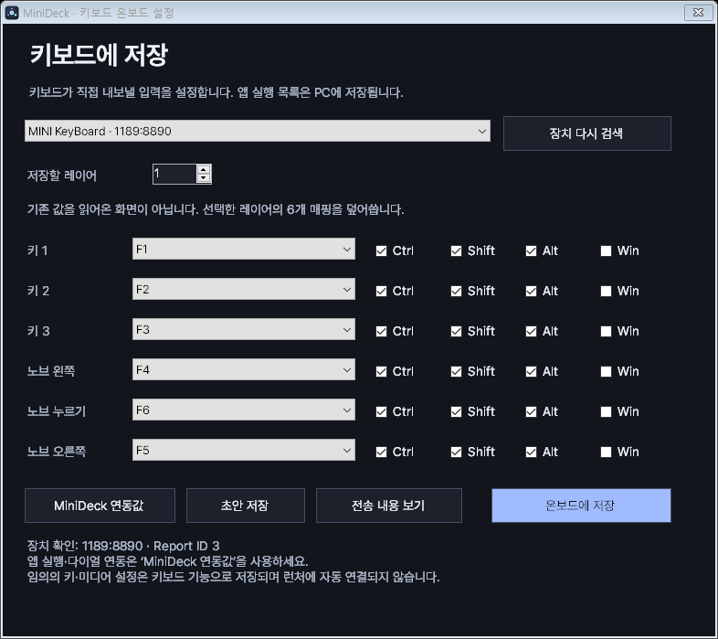

# MiniDeck

**돌려서 고르고, 눌러서 실행하세요.** 3키·누르기 지원 노브를 위한 Windows 원형 앱 런처입니다.

[English](README.md) · **한국어** · [다운로드](https://github.com/andrew00874/Minideck/releases) · [문제 제보](https://github.com/andrew00874/Minideck/issues)

<p align="center">
  
</p>

자주 쓰는 앱·폴더·웹사이트를 하나의 다이얼에 모아 두세요. 노브를 돌리면 아이콘 사이를 이동하고, 누르면 선택한 항목을 실행합니다. 세 개의 키에는 자주 쓰는 항목을 각각 지정해 바로 열 수 있습니다. 미니키보드가 없어도 마우스와 일반 키보드로 먼저 사용해 볼 수 있습니다.

## 주요 기능

| 기능 | 이렇게 사용합니다 |
| --- | --- |
| 원형 앱 선택 | 회전하며 고르면 선택한 아이콘이 커지고 중앙에 표시됩니다. |
| 키 3개 바로 실행 | 각 키에 서로 다른 항목을 지정합니다. |
| 위치·크기 저장 | 원하는 곳으로 드래그하고 지름을 280~560px로 조절합니다. |
| 아이콘 변경 | PNG·SVG를 미리 보고 적용합니다. 투명 배경도 지원합니다. |
| 긴 이름 표시 | 이름을 `…`으로 자르지 않고 줄바꿈하며, 아주 길면 스크롤할 수 있습니다. |
| 기존 웹 탭 전환 | Chrome 확장 설치 후 이미 열린 사이트 탭으로 돌아갑니다. |
| 온보드 매핑 편집 | 지원 키보드의 여섯 조작에 대한 키 매핑을 MiniDeck에서 저장합니다. |
| 트레이·자동 시작 | 트레이에 두고 사용하거나 Windows 로그인 시 자동 실행합니다. |

## 다운로드와 빠른 시작

| 언어 | 다운로드 |
| --- | --- |
| 한국어 | [MiniDeck 0.1.0-beta.2 — 한국어판 ZIP](https://github.com/andrew00874/Minideck/releases/download/v0.1.0-beta.2/MiniDeck-0.1.0-beta.2-win-ko.zip) |
| English | [MiniDeck 0.1.0-beta.2 — 영문판 ZIP](https://github.com/andrew00874/Minideck/releases/download/v0.1.0-beta.2/MiniDeck-0.1.0-beta.2-win-en.zip) |

**실행 환경:** Windows 10/11, .NET Framework 4.8 이상. 일반 사용에는 관리자 권한이 필요하지 않습니다. 현재 배포는 서명되지 않은 베타 버전입니다.

1. ZIP **전체를** 계속 사용할 폴더에 압축 해제합니다. 압축파일 안에서 바로 실행하지 마세요.
2. `MiniDeck.exe`를 실행합니다. DLL 파일과 `fonts` 폴더를 함께 유지해야 합니다.
3. **앱 추가**에서 이름과 실행 대상을 입력하고 저장합니다.
4. **누르기 / 열기**로 다이얼을 띄우고 **◀ 회전**, **회전 ▶**으로 선택을 바꿔 봅니다.
5. **키 1·2·3**에 실행할 항목을 지정하고, 아래 표에 맞춰 미니키보드 출력을 설정합니다.

한국어판과 영문판은 설정을 공유하므로 하나씩 실행하세요. 언어판을 바꿔도 직접 지정한 앱 이름과 아이콘은 유지됩니다.

## 1. 앱을 등록하고 세 키에 할당하기



왼쪽 목록의 순서가 다이얼의 순서입니다. 항목을 선택하면 이름·실행 대상·아이콘을 편집할 수 있습니다. **위로 / 아래로**로 순서를 바꿔도 키 할당은 같은 항목을 따라갑니다. **삭제**는 런처 목록에서만 제거하며 실제 프로그램을 지우지 않습니다.

아래의 선택 상자 세 개에서 각 키가 실행할 항목을 고르세요. **선택 앱 실행**으로 키보드 없이 실행을 시험할 수 있습니다.

실행 파일, 바로가기, 폴더, 웹 주소를 등록할 수 있습니다.

| 표시 이름 예시 | 실행 대상 | 실행 인수 |
| --- | --- | --- |
| 메모장 | `notepad.exe` | 비워 두기 |
| 작업 폴더 | `C:\Projects` — 실제 있는 폴더로 변경 | 비워 두기 |
| 웹사이트 | `https://example.com` | 비워 두기 — Chrome 확장 필요 |

실행 옵션이 필요하면 별도의 **실행 인수** 칸에 입력합니다. 기본 Codex 항목은 Windows 패키지 앱 ID를 사용하므로 해당 패키지가 설치된 PC에서만 동작합니다. Codex 내부의 `codex.exe` CLI 파일은 데스크톱 앱 실행 파일이 아닙니다.

## 2. 다이얼 조작하기

| 조작 | 동작 |
| --- | --- |
| 노브 왼쪽·오른쪽 회전 | 숨겨져 있으면 다이얼을 열고 선택 항목을 이동합니다. |
| 닫힌 상태에서 누르기 | 다이얼을 표시합니다. |
| 열린 상태에서 누르기 | 선택 항목을 실행하고 다이얼을 닫습니다. |
| 아이콘·가운데 클릭 | 마우스로 항목을 실행합니다. |
| 다이얼 드래그 | 실행하지 않고 위치만 옮깁니다. 놓은 위치는 저장됩니다. |
| Esc | 다이얼을 닫습니다. |
| 약 4.5초 동안 조작하지 않기 | 다이얼이 자동으로 닫힙니다. |

**다이얼 크기** 슬라이더로 지름을 280~560px 사이에서 조절합니다. 기본값은 360px이며, 위치와 크기는 재실행 후에도 유지됩니다. 모니터를 분리해 위치가 화면 밖이 되면 보이는 영역으로 보정합니다.

항목이 8개보다 많으면 회전하면서 다음 묶음으로 넘어갑니다. 긴 이름은 아래 캡슐에서 줄바꿈합니다. 아주 긴 이름은 캡슐 위에서 휠을 돌리거나 위·아래 부분을 클릭해 읽을 수 있습니다. 이름 위에 마우스를 두면 자동 닫힘이 잠시 멈춥니다.

### 키와 노브 출력 설정

각 조작이 아래 단축키를 보내도록 설정하세요. 회전은 한 칸마다 키를 한 번 누르고 떼는 방식이어야 합니다.

| 물리 조작 | 키보드 출력 |
| --- | --- |
| 키 1 / 키 2 / 키 3 | `Ctrl + Alt + Shift + F1 / F2 / F3` |
| 노브 왼쪽 / 오른쪽 | `Ctrl + Alt + Shift + F4 / F5` |
| 노브 누르기 | `Ctrl + Alt + Shift + F6` |

지원 장치라면 아래의 **키보드 온보드 설정**을 사용하고, 다른 장치라면 해당 키보드의 설정 프로그램을 사용하세요. 현재 런처는 전역 단축키 방식이므로 **미니키보드뿐 아니라 일반 키보드의 같은 조합에도 반응합니다.**

## 3. PNG·SVG로 아이콘 바꾸기



1. 항목을 선택하고 **앱 / 아이콘 수정**을 누릅니다.
2. **PNG / SVG 선택**으로 파일을 고르고 미리보기를 확인합니다.
3. **저장**을 누릅니다. 원래 모양으로 돌아가려면 **기본 아이콘**을 선택하세요.

투명 배경을 지원하며 파일은 최대 4MB입니다. PNG는 가로·세로 각각 4096px 이하여야 합니다. SVG는 자체 리소스만 사용해야 하며 외부 파일이나 인터넷 리소스는 읽지 않습니다.

아이콘은 MiniDeck 데이터 폴더로 복사되므로 원본 파일을 옮겨도 유지됩니다. 배포본의 `sample-icons/orbit.svg`로 시험할 수 있습니다.

## 4. 이미 열린 웹사이트 탭으로 돌아가기

웹사이트 항목은 **Chrome Browser Link**로 연결합니다. 실제 사이트를 사용하는 Chrome 프로필 한 곳에 한 번 설치하세요.

1. `browser-extension\setup.ps1`을 PowerShell로 실행해 로컬 연결을 등록합니다.
2. Chrome에서 `chrome://extensions`를 열고 **개발자 모드**를 켠 뒤 **압축해제된 확장 프로그램을 로드합니다**를 누릅니다.
3. 압축을 푼 `browser-extension` 폴더를 선택한 후 MiniDeck에서 웹사이트를 실행합니다.

**같은 사이트 탭이 있으면 전환 → 없으면 새 탭 생성.**

비교 기준은 origin, 즉 프로토콜·호스트·포트입니다. 예를 들어 `https://example.com`을 등록해 두고 `https://example.com/project`를 보고 있었다면 그 화면 그대로 돌아갑니다. 일치하는 탭 중 마지막으로 사용한 탭을 고르고, 최소화된 창은 복원합니다. 주소를 바꾸거나 페이지를 새로고침하지 않습니다.

서브도메인이 다르거나 다른 Chrome 프로필·다른 브라우저·시크릿 탭이면 검색 대상에서 제외됩니다. 확장이 연결되지 않았을 때는 중복 탭을 대신 열지 않고 안내를 표시합니다. 확장 아이콘을 눌러 다시 연결하거나 최대 30초의 자동 재연결을 기다리세요.

자세한 내용은 [확장 설치 안내](browser-extension/README.ko.md)를 참고하세요. 탭 정보와 로컬 연결을 사용하며 페이지 본문·쿠키·비밀번호를 읽거나 외부 서버에 보내지 않습니다. Chrome 웹 스토어 배포가 아닌 압축해제 확장 방식입니다. **Windows의 실제 Chrome에서 기존 탭 전환과 창을 맨 앞으로 가져오는 동작을 확인했습니다. 다른 브라우저 사용 시나리오는 추가 검증이 필요합니다.**

## 5. 지원 키보드에 매핑 저장하기



설정창 오른쪽 위의 **키보드 온보드 설정**을 엽니다. 확인된 지원 형식은 `1189:8890`, vendor 인터페이스 `MI_01`, 65바이트 출력 보고서, Report ID `3`입니다. 외형이 같더라도 내부 장치나 프로토콜은 다를 수 있습니다.

1. 지원 키보드를 한 대 연결하고 필요하면 **장치 다시 검색**을 누릅니다.
2. 저장할 레이어를 1~3 중 선택합니다.
3. 런처용이면 **MiniDeck 연동값**으로 채웁니다. 필요하면 각 키·미디어 기능·보조키를 직접 지정합니다.
4. **전송 내용 보기**에서 저장할 데이터를 확인합니다.
5. 여섯 매핑이 준비되면 **온보드에 저장**을 누르고, 분리·재연결 후 실제 조작을 확인합니다.

| 버튼 | 변경하는 내용 |
| --- | --- |
| MiniDeck 연동값 | 화면의 값을 채웁니다. 장치에는 쓰지 않습니다. |
| 초안 저장 | 현재 PC에만 초안을 저장합니다. |
| 전송 내용 보기 | 보낼 데이터를 표시합니다. 장치에는 쓰지 않습니다. |
| 온보드에 저장 | 선택한 레이어의 여섯 매핑을 덮어씁니다. |

화면에 보이는 값은 **장치 메모리에서 읽은 값이 아니라 PC의 초안**입니다. 기존 매핑의 자동 백업이나 저장 후 읽기 검증은 지원하지 않습니다. 연동값 이외의 키·미디어 기능은 런처 동작에 자동으로 연결되지 않습니다.

키보드에는 키 매핑이 저장되고 앱 목록과 MiniDeck 프로그램은 PC에 남습니다. 펌웨어 교체나 전용 네이티브 이벤트 방식은 아닙니다.

## 트레이·설정 백업·문제 해결

설정창을 닫으면 트레이로 숨깁니다. 트레이 아이콘을 두 번 클릭하면 돌아오며, 완전히 종료하려면 트레이 메뉴의 **종료**를 누릅니다. **Windows 로그인 시 자동 시작**은 선택 사항입니다. 실행 폴더를 옮겼다면 껐다 켜서 새 경로를 반영하세요.

설정은 `%APPDATA%\MiniDeck\settings.json`, 이전 저장본은 `.bak`에 있습니다. 아이콘은 `icons`, 온보드 초안은 `onboard-draft.json`에 저장됩니다. `onboard-*.log`는 전송 기록이며 장치 백업이 아닙니다. 설정을 백업하려면 MiniDeck을 종료하고 `%APPDATA%\MiniDeck` 폴더 전체를 복사하세요.

| 증상 | 확인할 내용 |
| --- | --- |
| 이미 실행 중이라고 나옴 | 트레이 아이콘을 확인하고, 언어판을 바꾸려면 먼저 종료합니다. |
| 단축키가 반응하지 않음 | 설정창 아래 충돌 안내와 기기의 여섯 매핑을 확인합니다. |
| 브라우저 연결이 끊겼다고 나옴 | Chrome을 열고 확장을 켠 뒤 아이콘을 누릅니다. 폴더를 옮겼다면 setup을 다시 실행합니다. |
| 키보드가 검색되지 않음 | 한 대만 연결하고 외형이 아닌 프로토콜 지원 여부를 확인합니다. |
| 설치 앱이 또 실행됨 | 기존 창 재사용은 인수 없는 절대 경로 EXE에 한정됩니다. 창 활성화가 실패하면 새 실행 요청으로 넘어갈 수 있습니다. |
| 다른 폴더로 복사한 뒤 실행 실패 | DLL·fonts 폴더가 모두 있는지, .NET Framework 4.8이 설치되어 있는지 확인합니다. |

## 베타 검증 범위

두 언어의 자체 테스트를 통과했고 영문 화면을 검토했습니다. 자동 검사는 설정·키 할당·전역 단축키·다이얼 이동과 크기·긴 이름·아이콘 가져오기·온보드 패킷·번역 누락·브라우저 탭 선택·로컬 메시지 연결을 다룹니다.

이 결과가 온보드 저장의 유지나 모든 미니키보드의 호환성을 보장하지는 않습니다. 실제 Chrome에서 기존 탭 전환과 창 활성화를 확인했으며, 다른 브라우저 사용 시나리오·관리자 권한 앱·혼합 DPI 환경은 추가 확인이 필요합니다. 위에서 설명한 제한적인 기존 창 재사용 이외의 설치 앱은 각 앱의 실행 정책에 따릅니다.

## 소스에서 빌드하기

Windows PowerShell 5.1 이상 또는 PowerShell 7을 사용합니다. Windows의 .NET Framework C# 컴파일러로 빌드하며, NuGet 의존성은 고정 버전을 내려받아 SHA-256을 확인합니다. JavaScript 검사에는 Node.js가 필요합니다.

```powershell
.\build.ps1 -Language ko
.\build.ps1 -Language en -OutputDirectory .\artifacts\en
.\scripts\package.ps1
```

`dist`에 한국어·영어 ZIP과 `SHA256SUMS.txt`가 생성됩니다. 개인 설정·진단 파일·제조사 프로그램은 제외됩니다. GitHub Actions는 `main` 변경 시 패키지를 빌드하고, `v*` 태그에서는 사전 릴리스도 생성합니다.

검사 전 실행 중인 MiniDeck을 종료하세요.

```powershell
node scripts/localization.cjs
node browser-extension/test.cjs
New-Item -ItemType Directory -Force artifacts\checks
.\MiniDeck.exe --self-test "$PWD\artifacts\checks"
.\MiniDeck.exe --preview "$PWD\artifacts\checks"
```

자체 테스트는 별도 설정을 사용합니다. 미리보기는 샘플 항목을 사용하며 이 문서의 스크린샷에도 개인 설정을 포함하지 않았습니다. 두 진단 모드는 온보드 쓰기 명령을 보내지 않습니다.

## 피드백과 외부 구성요소

[이슈](https://github.com/andrew00874/Minideck/issues)에 사용 언어판, Windows 버전, 재현 순서를 알려주세요. 키보드 문제는 장치 ID와 여섯 조작 중 어떤 것이 실패하는지 함께 적고, 로그에 개인 경로가 있으면 가려 주세요.

외부 라이브러리·폰트 고지는 [THIRD-PARTY.md](THIRD-PARTY.md), `licenses/`, `fonts/`에 있습니다. 제조사 실행 파일과 디컴파일한 코드는 포함하지 않습니다. 프로젝트 전체에 적용할 오픈소스 라이선스는 아직 정하지 않았으며 외부 구성요소는 각각의 라이선스를 따릅니다.

최종 확인: 2026-09-18 · 버전: 0.1.0-beta.2
