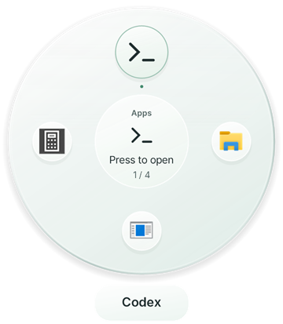
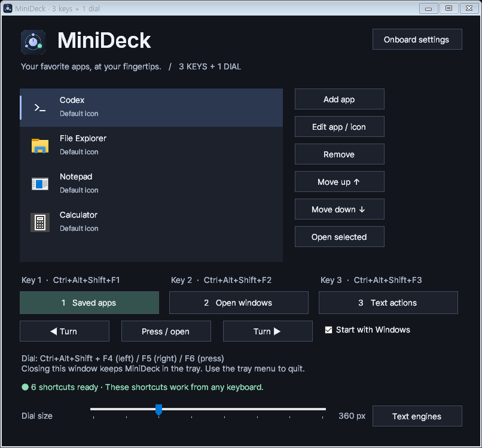
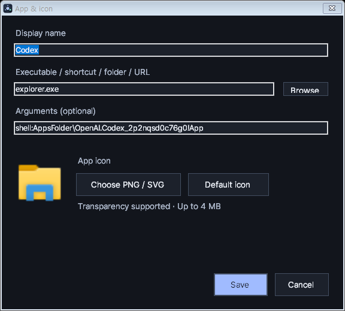
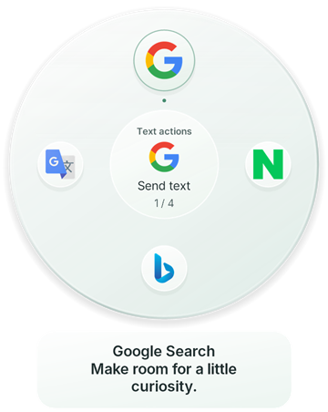
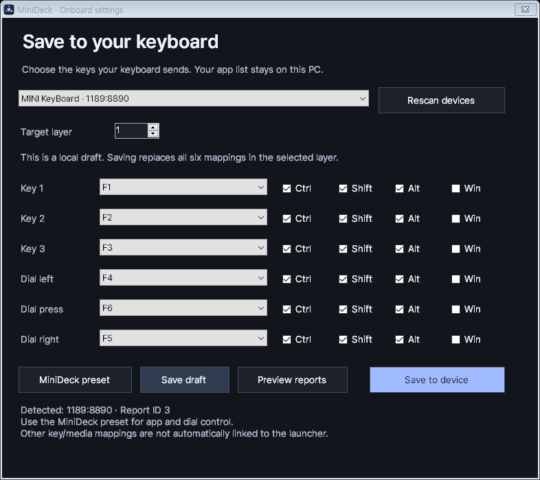

# MiniDeck

**Turn to choose. Press to open.** A circular Windows app launcher for a three-key macro pad with a pressable rotary dial.

**English** · [한국어](README.ko.md) · [Downloads](https://github.com/andrew00874/Minideck/releases) · [Report an issue](https://github.com/andrew00874/Minideck/issues)

<p align="center">
  
</p>

Keep your favorite apps, folders and websites on one dial. Turn the knob to move between icons, then press to launch the selected item. Three physical keys choose saved apps, open windows, or actions on selected text. You can also try the interface with a mouse or an ordinary keyboard.

## What it does

| Feature | How you use it |
| --- | --- |
| Circular app selection | Rotate through icons; the selected icon grows and appears in the center. |
| Three dial modes | Key 1: saved apps. Key 2: open windows. Key 3: selected-text actions. |
| Position and size | Drag the dial anywhere; choose a diameter from 280 to 560 px. Both are saved. |
| Custom icons | Import a PNG or SVG with transparency and preview it before saving. |
| Full app names | Names wrap instead of ending in an ellipsis; very long names can be scrolled. |
| Existing website tabs | With Chrome Browser Link installed, return to an existing site tab instead of opening another. |
| Onboard mapping editor | Write the six control mappings to a supported keyboard from MiniDeck. |
| Tray and startup | Keep MiniDeck in the tray and optionally start it with Windows. |

## Download and quick start

**New in 0.2.0-beta.1:** three dial modes and service SVG icons. When upgrading, replace both executables and reload Browser Link 1.1.0 in Chrome.

| Edition | Download |
| --- | --- |
| English | [MiniDeck 0.2.0-beta.1 — English ZIP](https://github.com/andrew00874/Minideck/releases/download/v0.2.0-beta.1/MiniDeck-0.2.0-beta.1-win-en.zip) |
| 한국어 | [MiniDeck 0.2.0-beta.1 — Korean ZIP](https://github.com/andrew00874/Minideck/releases/download/v0.2.0-beta.1/MiniDeck-0.2.0-beta.1-win-ko.zip) |

**Requirements:** Windows 10/11, .NET Framework 4.8 or newer. Normal use does not require administrator access. This beta is unsigned.

1. Extract the **entire ZIP** into a folder you plan to keep. Do not run it from inside the archive.
2. Open `MiniDeck.exe`. Keep the DLL files and `fonts` folder beside it.
3. Click **Add app**, enter a name and launch target, then save.
4. Click **Press / open** to show the dial; use **◀ Turn** and **Turn ▶** to try selection.
5. Configure the six keyboard outputs below. Keys **1 / 2 / 3** select **Saved apps / Open windows / Text actions**. Existing MiniDeck mappings need no rewrite.

Both language editions share settings. Run only one at a time; switching editions preserves your own app names and icons.

## 1. Add apps and choose a mode



The left list is the dial's order. Select an item to edit its name, target or icon. **Move up / Move down** changes the order; the app dial follows that order. **Remove** removes the launcher entry, not the installed app.

Use **1 Saved apps** for launch targets, **2 Open windows** to switch between existing windows without launching an app, and **3 Text actions** for the text workflow below. **Open selected** still tests an app launch.

Launch targets can be executables, shortcuts, folders or web URLs. For example:

| Display name | Target | Arguments |
| --- | --- | --- |
| Notepad | `notepad.exe` | Leave blank |
| Work folder | `C:\Projects` (use an existing folder) | Leave blank |
| Website | `https://example.com` | Leave blank; Chrome extension required |

Put command-line arguments in the separate **Arguments** field. The sample Codex entry uses its Windows package app ID and only works where that package is installed. Its internal `codex.exe` CLI is not the desktop launcher.

## 2. Use the dial

| Action | Result |
| --- | --- |
| Turn left or right | Move the selection. If hidden, reopen the current mode; window/text modes refresh first. |
| Press while hidden | Show the dial. |
| Press while visible | Open the selected item and close the dial. |
| Click an icon or the center | Open an item with the mouse. |
| Drag the dial | Move it without launching anything; the position is saved. |
| Press Esc | Dismiss the dial. |
| Leave it idle | It closes after about 4.5 seconds. |

The **Dial size** slider sets a 280–560 px diameter; the default is 360 px. Position and size survive restarts. If a monitor is removed, the dial is moved back onto a visible screen.

More than eight items appear in groups as you turn. Long names wrap in the caption below the dial. For exceptionally long names, scroll over the caption or click its upper/lower area. Hovering over the caption pauses the idle timeout.

### Configure your keys and knob

Map each physical control to the following keyboard shortcut. A turn should emit one press-and-release per detent.

| Physical control | Keyboard output |
| --- | --- |
| Key 1 / Key 2 / Key 3 | `Ctrl + Alt + Shift + F1 / F2 / F3` |
| Dial left / right | `Ctrl + Alt + Shift + F4 / F5` |
| Dial press | `Ctrl + Alt + Shift + F6` |

Use the built-in **Onboard settings** for a supported device, or your keyboard's configuration tool. These are global shortcuts: **MiniDeck currently responds to them from any keyboard**, not just one specific device.

## 3. Give each item its own icon



1. Select an item and click **Edit app / icon**.
2. Click **Choose PNG / SVG** and inspect the preview.
3. Click **Save**. Use **Default icon** to return to the app's default appearance.

Transparent backgrounds are supported. Files must be at most 4 MB; PNG dimensions must not exceed 4096 px per side. SVGs must be self-contained: external files and network resources are not loaded.

Imported icons are copied into MiniDeck's data folder, so moving the original file will not break them. Try the included `sample-icons/orbit.svg`.

## 4. Return to an existing website tab

Website entries use **Chrome Browser Link**. Install it once in the Chrome profile where you use your sites:

1. Run `browser-extension\setup.ps1` with PowerShell to register the local connection.
2. Open `chrome://extensions`, enable **Developer mode**, and select **Load unpacked**.
3. Select the extracted `browser-extension` folder, then choose a website from MiniDeck.

**Matching tab exists → activate it. No matching tab → open one.**

Matching uses the same origin: scheme, hostname and port. For example, a saved `https://example.com` entry can return to `https://example.com/project` without navigating away from it. The most recently used matching tab is selected, its window is restored if minimized, and the page is not refreshed.

Different subdomains, other Chrome profiles, other browsers and incognito tabs are excluded. If the extension is disconnected, MiniDeck shows a message instead of opening a duplicate. Click the extension icon to reconnect, or allow up to 30 seconds for automatic reconnection.

See [the full extension guide](browser-extension/README.md). The extension uses tab metadata and a local native-messaging connection. It does not scrape page contents, cookies or passwords. In text mode, confirming an engine navigates to its result URL with your selection. It is loaded unpacked, not from the Chrome Web Store. **Existing-tab switching and bringing Chrome to the foreground have been confirmed on a Windows/Chrome installation. Other browser scenarios still need broader testing.**

## Search and translate selected text



1. Select text in the app you are using.
2. Press **key 3**, then release the keys. MiniDeck reads the selection before showing the dial.
3. Rotate to choose **Google Search, Naver Search, Bing Search, or Google Translate**. Review the original text below the dial.
4. Press the knob to send it and show the web result. **Esc**, switching modes, or idle dismissal cancels without sending.

No API key is needed. **Text engines** in Settings lets you add/edit a display name and HTTP(S) URL containing `{text}`. Click **Apply item** before editing another entry, then **Save**. Google Translate defaults to Korean in the KO edition and English in the EN edition; existing settings retain their target language.

**Update Browser Link to 1.1.0:** replace both app/host files and the extension folder, then reload MiniDeck Browser Link at `chrome://extensions`. Text actions use a separate result tab per engine and update its query. Ordinary website entries continue to preserve existing pages. Result-tab tracking resets when Chrome or the extension restarts; a new result tab is then created.

Selection is held only in memory and cleared when dismissed; MiniDeck does not save it to settings or logs. The confirmed URL can appear in browser history and is received by the selected service. Capture first uses Windows UI Automation, then falls back to Ctrl+C while preserving the clipboard where possible. Some apps copy a line when nothing is selected, so check the preview. Empty, unavailable or overlong selections are rejected (2,000 characters; encoded URLs also have a limit). Elevated/protected apps may deny capture. The connected-device selection → key 3 → engine → knob press → result-page flow was confirmed by the user. Compatibility with other apps and elevated windows still needs broader testing.

## 5. Save mappings to a supported keyboard



Open **Onboard settings** in the top-right corner of Settings. The editor supports the identified `1189:8890` device protocol: vendor interface `MI_01`, 65-byte output reports and Report ID `3`. The same enclosure does not guarantee the same electronics or protocol.

1. Connect one supported keyboard and click **Rescan devices** if needed.
2. Choose a layer from 1 to 3.
3. Click **MiniDeck preset** to fill the launcher shortcuts, or configure each key/media action and modifier.
4. Use **Preview reports** to inspect what will be sent.
5. Click **Save to device** only when the six mappings are ready. Reconnect and test the physical controls afterward.

| Button | What it changes |
| --- | --- |
| MiniDeck preset | Fills the form; does not write to the device. |
| Save draft | Saves the draft on this PC only. |
| Preview reports | Shows the outgoing data; does not write to the device. |
| Save to device | Replaces all six mappings in the selected device layer. |

The form displays a local draft, **not a readback of device memory**. Original mappings cannot be automatically backed up or read back for verification. Non-preset keys/media controls are not automatically linked to launcher actions.

The keyboard stores key mappings; the app list and MiniDeck itself remain on the PC. This is not a firmware replacement or a dedicated native-event input mode.

## Tray, settings and troubleshooting

Closing the settings window hides it in the tray. Double-click the tray icon to return, or choose **Quit** to exit. **Start with Windows** is optional. After moving the app folder, toggle that option off and on to update its path.

Settings are saved in `%APPDATA%\MiniDeck\settings.json`, with the previous save in `.bak`. Custom icons are in `icons`; the onboard draft is `onboard-draft.json`. Onboard transfer logs describe intended writes and are not device backups. To back up your configuration, quit MiniDeck and copy the whole `%APPDATA%\MiniDeck` folder.

| Problem | Check |
| --- | --- |
| Another MiniDeck is already running | Open its tray icon; quit it before switching language editions. |
| Shortcuts do nothing | Check the status line for conflicts and verify the keyboard's six mappings. |
| Browser Link is disconnected | Open Chrome, enable the extension and click its icon. Rerun setup after moving MiniDeck. |
| Keyboard is not detected | Connect only one supported device; check its protocol, not just its appearance. |
| An installed app opens again | Existing-window reuse is limited to absolute-path EXEs without arguments and can fall back to launching if activation fails. |
| The app fails after being copied | Extract all DLLs and the `fonts` folder; check .NET Framework 4.8 is installed. |

## Beta status

Both language builds passed the app self-tests; English screens were visually reviewed. Automated checks cover settings migration, selection capture, confirmation/cancellation, window lifetime checks, global hotkeys, dial navigation/drag/size, long captions, icon import, onboard packet encoding, translation coverage, browser routing and the local native-message transport.

These checks do **not** prove onboard write persistence or compatibility with every mini keyboard. Existing-tab switching and foreground activation were also confirmed in Chrome on Windows. Other browser scenarios, elevated apps and mixed-DPI displays need further validation. Desktop apps outside the limited reuse case follow their normal launch behavior.

## Build from source

Use Windows PowerShell 5.1+ or PowerShell 7. Build scripts use the Windows .NET Framework C# compiler and restore pinned NuGet dependencies with SHA-256 verification. Node.js is needed only for the JavaScript checks.

```powershell
.\build.ps1 -Language ko
.\build.ps1 -Language en -OutputDirectory .\artifacts\en
.\scripts\package.ps1
```

Packaging creates two language ZIPs and `SHA256SUMS.txt` in `dist`. Personal settings, diagnostics and manufacturer software are excluded. The GitHub Actions workflow builds packages on `main`; a `v*` tag also publishes a prerelease.

Close MiniDeck before running checks:

```powershell
node scripts/localization.cjs
node browser-extension/test.cjs
New-Item -ItemType Directory -Force artifacts\checks
.\MiniDeck.exe --self-test "$PWD\artifacts\checks"
.\MiniDeck.exe --preview "$PWD\artifacts\checks"
```

Self-tests use isolated settings. Preview mode uses sample entries; the screenshots above come from that mode, not personal configurations. Neither diagnostic mode sends onboard write commands.

## Feedback and third-party notices

[Open an issue](https://github.com/andrew00874/Minideck/issues) with the language edition, Windows version and steps to reproduce. For keyboard issues, include the device ID and which of the six controls fails; redact personal paths from any logs.

Bundled library and font notices are in [THIRD-PARTY.md](THIRD-PARTY.md), `licenses/` and `fonts/`. Original manufacturer executables and decompiled vendor code are not included. No project-wide open-source license has been selected yet; third-party components retain their own licenses.

Last reviewed: 2026-09-18 · Version: 0.2.0-beta.1
